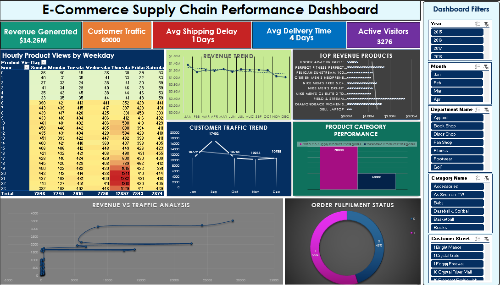

# E-Commerce-Supply-Chain-Performance-Analysis-Excel
Interactive Excel Dashboard for E-Commerce Supply Chain Performance Analysis using Pivot Tables, Charts, Slicers, and Data Visualization.

## Project Overview

This project presents an interactive Excel dashboard designed to analyze e-commerce supply chain performance and customer traffic patterns.

The dashboard provides insights into revenue trends, customer engagement, product category performance, delivery efficiency, and order fulfillment status.

---
## Key Features
- Revenue Trend Analysis
- Customer Traffic Analysis
- Product Category Performance
- Order Fulfillment Monitoring
- Interactive Dashboard Filters

## Dashboard Preview

---
## Key Metrics
- Revenue Generated: $14.26M
- Customer Traffic: 60,000
- Average Shipping Delay: 1 Day
- Average Delivery Time: 4 Days
- Active Visitors: 3,276

---
## Dashboard Features

### Revenue Trend Analysis
Tracks monthly revenue performance and identifies sales patterns.

### Customer Traffic Trend
Analyzes visitor traffic trends across different periods.

### Product Category Performance
Compares product category engagement and performance.

### Revenue vs Traffic Analysis
Examines the relationship between customer traffic and revenue generation.

### Order Fulfillment Status
Monitors order completion and fulfillment efficiency.

### Interactive Filters
- Year
- Month
- Department
- Category
- Customer Location
---
## Tools Used
- Microsoft Excel
- Pivot Tables
- Pivot Charts
- Slicers
- Conditional Formatting
- Dashboard Design
---
## Business Insights
- Revenue remained relatively stable throughout the year.
- Customer traffic showed seasonal fluctuations.
- Certain product categories generated higher engagement.
- Order fulfillment performance remained consistent.
- Dashboard filters enable dynamic business analysis.
---
## Files Included
- E-Commerce_Supply_Chain_Performance_Dashboard.xlsx
- Dashboard.png
- README.md
---
## Author
Siri Vennela
